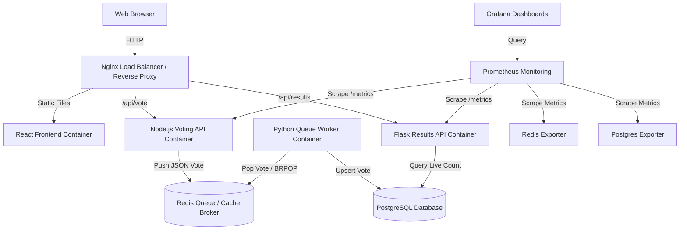

# Multi-Container Production Voting App (DevOps Infrastructure Project)

This repository contains a production-ready, highly available, and fully monitored multi-container **Voting Application**. Designed using microservices, it leverages containerization, orchestration, real-time monitoring, and automatic CI/CD workflows to simulate a professional enterprise-grade deployment.

---

## 🏗️ Architecture Design

The application follows a polyglot microservice layout designed to handle high-throughput loads and isolate operations:



### Microservice Sub-Components:
1. **Frontend (React)**: An interactive SPA built using **React 19, Vite, and TypeScript**. Features a dark glassmorphic UI, real-time results dashboards, and session state tracking.
2. **Voting API (Node.js)**: A lightweight Express server serving `/api/vote`. It acts as an ingestion broker, queueing incoming votes into Redis instantly to prevent database write locks under high load.
3. **Queue Broker (Redis)**: An in-memory queue storing serialized votes using a list buffer (`votes`).
4. **Data Worker (Python)**: A daemon worker running in the background. It uses blocking pop (`BRPOP`) to consume votes from Redis and upserts them into PostgreSQL. Includes automatic database retry logic.
5. **Results API (Python/Flask)**: An analytical server serving `/api/results`. Queries PostgreSQL database to serve aggregated election metrics.
6. **Database (PostgreSQL)**: Relational storage serving as the source of truth for vote counts.
7. **Reverse Proxy (Nginx)**: The single gateway acting as a reverse proxy, routing API requests, serving assets, implementing gzip compression, and adding OWASP security headers.
8. **Monitoring (Prometheus & Grafana)**: Unified monitoring dashboard tracking endpoint request rates, system health, vote telemetry, and container performance.

---

## 📁 Repository Folder Structure

```text
├── .github/
│   └── workflows/
│       └── ci-cd.yml          # GitHub Actions CI/CD Pipeline
├── backend-results/
│   ├── app.py                 # Flask Results API
│   ├── Dockerfile             # Multi-stage production Python runner
│   └── requirements.txt
├── backend-vote/
│   ├── src/
│   │   └── index.js           # Express Voting Ingestion API with Prometheus metrics
│   ├── Dockerfile             # Multi-stage production Node runner
│   └── package.json
├── frontend/
│   ├── src/
│   │   ├── App.css            # Custom glassmorphic styling
│   │   ├── App.tsx            # Main React SPA component
│   │   ├── index.css          # Theme configs and Google fonts
│   │   └── main.tsx
│   ├── nginx.conf             # Custom routing for frontend container static server
│   ├── Dockerfile             # Node builder + Nginx static hosting
│   ├── package.json
│   └── vite.config.ts
├── nginx/
│   ├── nginx.conf             # Central reverse proxy configuration (security/caching)
│   ├── 502.html               # Custom maintenance page when services startup
│   └── Dockerfile
├── prometheus/
│   └── prometheus.yml         # Prometheus scrape definitions
├── grafana/
│   └── provisioning/          # Autoprovisioning datasources and dashboards
│       ├── datasources/
│       │   └── datasource.yml
│       └── dashboards/
│           ├── dashboard.yml
│           └── voting-dashboard.json
├── worker/
│   ├── worker.py              # Python database persistence daemon
│   ├── Dockerfile
│   └── requirements.txt
├── docker-compose.yml         # General Local Orchestration file
├── docker-compose.prod.yml    # Hardened Production Orchestration file (Caps/Exporters)
└── README.md
```

---

## 🚀 Local Run Guide (Docker & Compose)

### 📋 Prerequisites
- Make sure [Docker](https://www.docker.com/) and [Docker Compose](https://docs.docker.com/compose/) are installed.

### 🕹️ Spin Up the Stack
1. Clone this repository and navigate to the folder.
2. Build and start all 9 services in detached mode:
   ```bash
   docker compose up --build -d
   ```
3. Verify all containers are running successfully:
   ```bash
   docker compose ps
   ```

### 🔗 Service Ports
* **Voting Web UI (via Nginx)**: [http://localhost](http://localhost)
* **Prometheus Telemetry**: [http://localhost:9090](http://localhost:9090)
* **Grafana Dashboards**: [http://localhost:3000](http://localhost:3000) (Login Credentials: `admin` / `admin`. You can skip or set a new password on login).

### 🧪 Test the Infrastructure
1. Go to [http://localhost](http://localhost) and cast a vote (e.g. for Deep Space or Deep Ocean).
2. Open Grafana at [http://localhost:3000](http://localhost:3000). Go to **Dashboards** > **Operations** > **Voting App Infrastructure Dashboard** to monitor the live vote streams, queue state, and HTTP request metrics.
3. Terminate the local cluster:
   ```bash
   docker compose down -v
   ```

---

## ☁️ Production Deployment on AWS EC2

### 1. Provision the EC2 Instance
- Launch an EC2 Instance using **Ubuntu Server 22.04 LTS** (t2.medium is recommended for run stability with Prometheus/Grafana).
- Configure the **Security Group** to allow inbound traffic on:
  - Port `80` (HTTP)
  - Port `443` (HTTPS)
  - Port `3000` (Grafana Analytics - optionally restrict to admin IP)
  - Port `9090` (Prometheus Scraper - restrict access to admin IP)
  - Port `22` (SSH for access)

### 2. Install Docker & Compose on EC2
Connect to your EC2 instance via SSH and run:
```bash
# Update local packages
sudo apt-get update && sudo apt-get upgrade -y

# Install Docker dependencies
sudo apt-get install -y ca-certificates curl gnupg lsb-release

# Add Docker’s official GPG key
sudo mkdir -p /etc/apt/keyrings
curl -fsSL https://download.docker.com/linux/ubuntu/gpg | sudo gpg --dearmor -o /etc/apt/keyrings/docker.gpg

# Set up repository
echo \
  "deb [arch=$(dpkg --print-architecture) signed-by=/etc/apt/keyrings/docker.gpg] https://download.docker.com/linux/ubuntu \
  $(lsb_release -cs) stable" | sudo tee /etc/apt/sources.list.d/docker.list > /dev/null

# Install Docker Engine
sudo apt-get update
sudo apt-get install -y docker-ce docker-ce-cli containerd.io docker-compose-plugin

# Enable Docker on boot
sudo systemctl enable docker
sudo systemctl start docker

# Add Ubuntu user to Docker group
sudo usermod -aG docker ubuntu
```
*Note: Log out and log back in to execute docker commands without `sudo`.*

### 3. Deploy the Stack on EC2
You can deploy using the pre-built Docker Hub images compiled via CI/CD, or copy the codebase to the server and compile on-instance:
```bash
# Spin up utilizing the production Compose override
docker compose -f docker-compose.prod.yml up -d
```

### 4. Setup SSL/TLS with Let's Encrypt (Certbot)
To secure the server under HTTPS:
```bash
# Install Certbot and the Nginx plugin
sudo apt-get install -y certbot python3-certbot-nginx

# Request the SSL certificate (Replace yourdomain.com with your active DNS record mapping)
sudo certbot --nginx -d yourdomain.com
```
Certbot will automatically verify ownership, fetch the certificate, and update the host's Nginx configuration to rewrite all port 80 traffic to 443 (SSL).

---

## 🛠️ Monitoring and Telemetry Setup

Metrics are exposed from the following sources and collected by Prometheus every 5 seconds:
* **Node.js (Voting API)**: Exposes metrics via `prom-client` on `/metrics`.
* **Flask (Results API)**: Exposes metrics via `prometheus-client` on `/metrics`.
* **Redis (Queue)**: Monitored via the `redis-exporter` sidecar container.
* **PostgreSQL (DB)**: Monitored via the `postgres-exporter` sidecar container.

### Pre-Configured Grafana Dashboard:
The dashboard JSON (`voting-dashboard.json`) is loaded automatically on startup. It includes:
* **Vote Submissions by Option**: A real-time timeline displaying Option A and Option B vote totals.
* **Total Votes Count**: A cumulative gauge visual showing total transaction flow.
* **HTTP Request Rates**: Line graphs tracking incoming requests per minute across APIs.
* **Results API Request Latency**: High-fidelity timeline monitoring database connection speed and response times.

---

## 🛑 Troubleshooting Guide

### 1. Flask Results API returning 500 / "Database connection unavailable"
* **Cause**: PostgreSQL is still starting up or database credentials do not match.
* **Fix**: Run `docker compose logs db` to verify Postgres startup state. Check that `POSTGRES_PASSWORD` in `backend-results` matches the credential set in the `db` service.

### 2. Votes are submitted but not updating in results
* **Cause**: Python database worker service is offline or blocked.
* **Fix**: 
  1. Inspect the worker logs: `docker compose logs worker`.
  2. Verify that Redis has items in the queue:
     ```bash
     docker compose exec redis redis-cli LLEN votes
     ```
     If the length is greater than 0 and growing, the worker is failing to write to Postgres. Check database connectivity logs.

### 3. Nginx 502 Bad Gateway
* **Cause**: Backend containers (vote-api, results-api, frontend) are starting up, crashed, or not responding on ports 5000/5001.
* **Fix**: Check status using `docker compose ps`. If they are crashing, read logs via `docker compose logs backend-vote` or `docker compose logs backend-results`.

---

## 🛡️ Production DevOps Best Practices

1. **Non-Root Execution**: Both Node.js, Flask, and the Python Worker run using low-privilege system users (`node`, `flask`, `worker`) instead of `root` to mitigate container escape vulnerabilities.
2. **Resource Allocation**: The `docker-compose.prod.yml` file restricts CPU and memory consumption per container using Docker limits to prevent denial-of-service (DoS) states due to resource leaks.
3. **Database Security**:
   - Databases (Postgres, Redis) are kept off host ports (port `5432` and `6379` are not exposed to the internet). Only Nginx exposes port 80/443.
   - Separate credentials should be rotated regularly and stored inside AWS Secrets Manager or secure env files instead of raw commits.
4. **Queue-Based Asynchronous Operations**: The Node.js Voting API never blocks on database writes. It writes to Redis in milliseconds and returns, delegating database upserts to a background Python worker. This ensures high availability under traffic spikes.
